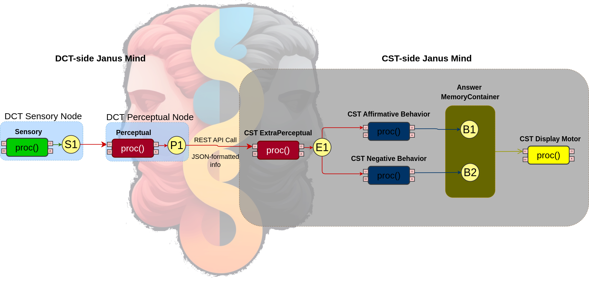

# Janus, a multilanguage Cognitive System

This repo contains a simple use case integrating [CST](https://github.com/CST-Group/cst) and [DCT](https://github.com/wandgibaut/dct), having and information flow from (DCT) Codelets in Python to (CST) Codelets in Java.

On Python side, Janus will read a .npy file containing a list of numpy arrays and, one-by-one, will pass each entry through a ML model. After that the prediction result may be accessed by the Java side of the agent, activating a specific behavior (depending on prediction result) and finally printing a message on terminal. We use the simplified [propublica compas dataset for fair ML](https://github.com/adebayoj/fairml/blob/master/doc/example_notebooks/propublica_data_for_fairml.csv) in which the classifier will judge if the subject will reincid or not.
 
 ## How it works

First, you'll need to create and activate a virtual environment. Instructions may be found [here](https://docs.python.org/3/tutorial/venv.html) and [here](https://www.freecodecamp.org/news/how-to-setup-virtual-environments-in-python/).

You'll need to install dct package manually (sorry about that, we'll fix it soon):

    cd python/dct
    pip install .
    cd ../ # you should be in python folder now

Then, install the other required packages:

    pip3 install -r requirements.txt

Notice that we used localhost and ports 5000 to 5003, but this may be customized by changing both the Python script`s arguments and the Java agent's internal (hardcoded) parameter. The ML model can be selected from the six methods in the 'models' folder, but it also has to be changed manually.

After that, running the Java program will execute the proposed example.

### What is going on?

This simple agent will, in Python, read a npy file, call an ML model and put the result that can be reached via API calls. A Java process will make HTTP GET requests and print a textual response on terminal about the ML prediction.

The figure below illustrates the Agent's topology.

### Why Janus?

According to [Wikipedia](https://en.wikipedia.org/wiki/Janus), Janus is the god of beginnings, gates, transitions, time, duality, doorways, passages, frames, and endings. He is usually depicted as having two faces. Also, Janus presided over the beginning and ending of conflict, and hence war and peace. As a god of transitions, he had functions pertaining to birth and to journeys and exchange. The month of January is named for Janus (Ianuarius)